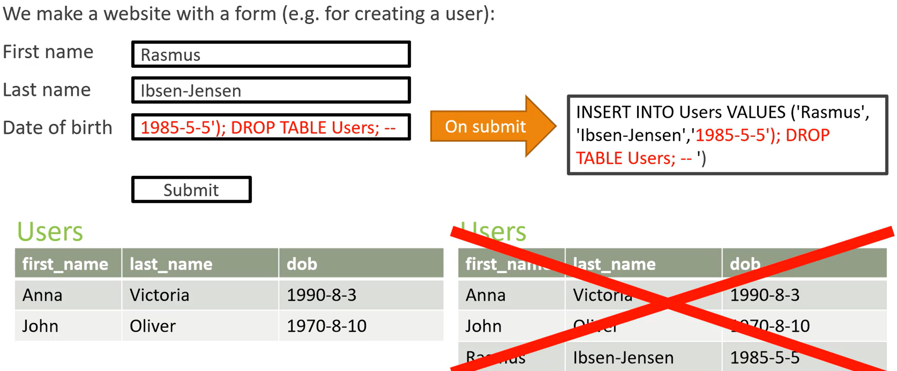

# Database Other Important Knowledges

## SQL Injection SQL 注入(攻击)

### SQL Injection Sample

e.g.
In this sample, the injection will cause a delete of the table `Users`

### Ways to avoid SQL injection attacks

1. Input validation
   - Check that the input is valid for the field entered
2. Use prepared statements
   - Most programming languages lets you use these: In essence, you write the query, except have some ? or similar in the query, which you can then later replace with say a first name or similar. 
   - 对用户的所有输入字符进行转译
3. Stored procedures
   - Like prepared statements, but stored in the database instead of in your programming language
4. Escaping
   - Make sure that you escape all characters users input – there should be functions for this in most programming languages
