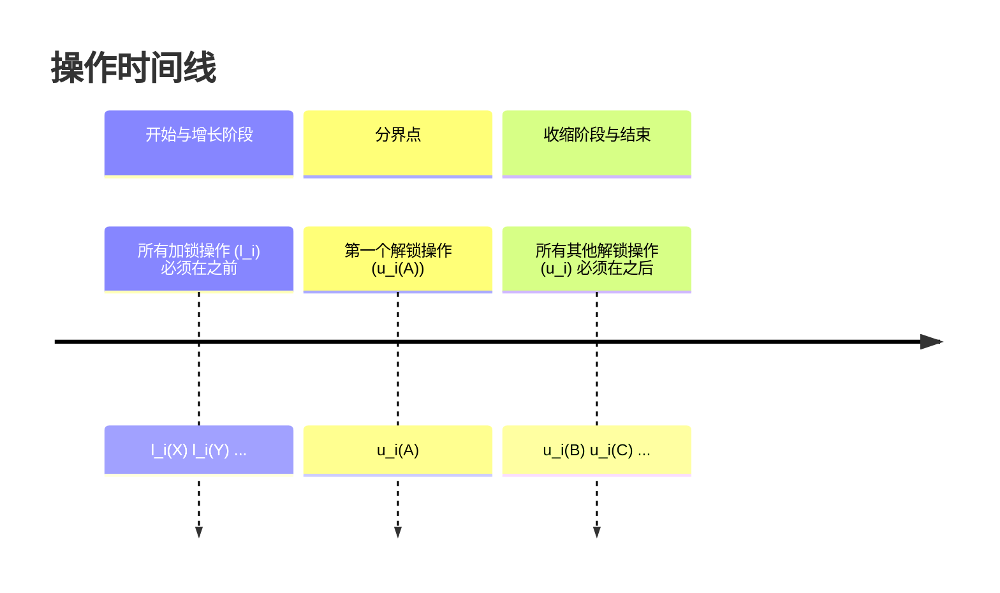
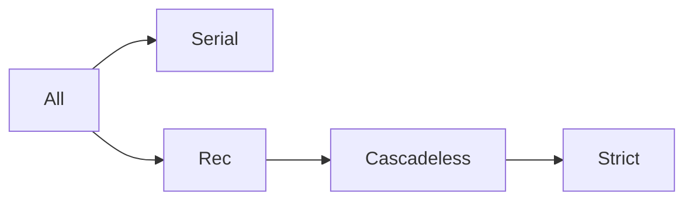
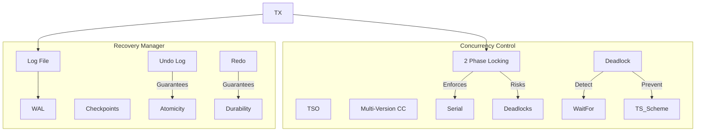
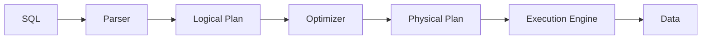

# Database Transactions

**Transactions 事务:** 一系列DML的封装 (一个不可分割的逻辑工作单元，包含一组操作，这些操作要么全部成功，要么全部失败)

## ACID

| Properties  |        | Definition                                                     |                                                  | Implementation                            |
| ----------- | ------ | -------------------------------------------------------------- | ------------------------------------------------ | ----------------------------------------- |
| Atomicity   | 原子性 | Transactions are fully executed or not at all                  | 事务全部执行或全部回滚/不执行（无中间状态）。    | Undo logging, Undo/Redo logging, Force    |
| Consistency | 一致性 | Schedule executes transactions equivalent to a serial schedule | 事务前后数据库保持一致状态（如转账总金额不变）。 | Serializability, Conflict-Serializability |
| Isolation   | 隔离性 | Transactions are isolated from each other                      | 并发事务互不干扰，相互隔离（防止脏读）。         | Cascadeless and Strict schedules          |
| Durability  | 持久性 | If a transaction is committed, it does not disappear           | 事务提交后数据永久保存。                         | Redo logging, Undo/Redo logging, No Steal |

**Isolation Levels 隔离级别**

```sql
SET TRANSACTION ISOLATION LEVEL [...]
```

### Dirty Read 脏读

A dirty read occurs when a transaction reads data written by another uncommitted transaction. This can happen when the isolation property is not fully enforced, leading to inconsistent or temporary data being read.
事务读取了另一个未提交事务写入的数据。当隔离性（Isolation）未完全强制执行时，可能发生脏读，导致读取到不一致或临时的数据。

Efficiency:
脏读的主要原因是效率优化（efficiency optimization）。数据库系统有时不完全强制执行隔离性，以允许更多并行性（parallelism）。这减少了事务等待时间，但增加了脏读风险。

Effects:
脏读可能导致系统性能下降，尤其当事务中止（abort）时。如果事务T2读取了事务T1写入的未提交数据，然后T2提交，但T1后续中止，这会破坏数据库的一致性（Consistency）和持久性（Durability）。

## Concurrency Control 并发控制

**Goals of Concurrency Control**
- Ensures conflict-serialisable schedules
- Ensures strict schedules
- Avoids deadlocks and starvation

### Two-Phase Locking Protocol (2PL) 两阶段锁协议
Two-Phase Locking (2PL)is an important protocol in *concurrency control* that ensures **serializability** of transaction schedules. **It divides the *lock* and *unlock* operations of a transaction into two distinct phases.**

**Definition of the Two Phases**
1. Growing Phase (Request Locks)
   - Transactions can **acquire** locks but cannot release any locks
   - The number of locks can **only increase** or remain the same
   - The transaction enters the shrinking phase after the growing phase ends
2. Shrinking Phase (Unlock)
   - Transactions can **release** locks but cannot acquire new locks
   - The number of locks can **only decrease** or remain the same
   - Once in the shrinking phase, cannot return to the growing phase

**Symbol Representation**
$l_i(X)$ Transaction $T_i$ requests a **lock** on data item $X$
$u_i(X)$ Transaction $T_i$ releases the lock/**unlock** it holds on data item $X$

**Rules**
once a transaction releases any lock, it can never acquire a new lock.
一旦事务释放了任何锁，就不允许它再获取新的锁。



### Strict 2PL 严格2PL
Standard 2PL guarantees serializability but allows Cascading Rollbacks. To prevent this, we use Strict 2PL.
标准 2PL 保证可串行化，但允许级联回滚。为了防止这种情况，我们使用严格 2PL。

- Rule: Hold all Exclusive (Write) Locks until the transaction Commits or Aborts. 持有所有排他（写）锁，直到事务提交或中止。
- Benefit: Prevents reading uncommitted data (Dirty Reads) effectively. 有效防止读取未提交的数据（脏读）。

### Lock Modes & Hierarchy 锁模式与层级
To optimize performance, we introduce lock types and granularity. 为了优化性能，我们引入锁类型和粒度。

**Lock Types**

- Shared (S): For Reading. Compatible with S.
- Exclusive (X): For Writing. Incompatible with everything. 独占：与所有状态不兼容。
- Update (U): "I intend to update". Compatible with S, but incompatible with U or X. Prevents deadlock during read-to-write upgrades.

**Intention Locks - Multi-Granularity**
Solved the problem: "Does anyone hold a lock on a row inside this table?" without scanning all rows.“是否有人持有该表中某一行的锁？”而无需扫描所有行。

- Protocol: Before locking a child node (Row), must lock parent (Table) with Intention.
- IS (Intention Shared): "I will lock a child in S mode."
- IX (Intention Exclusive): "I will lock a child in X mode."

Compatibility Matrix (兼容性矩阵):
| Hold \ Request | IS  | IX  | S   | SIX | X   |
| -------------- | --- | --- | --- | --- | --- |
| IS             | √   | √   | √   | √   | ×   |
| IX             | √   | √   | ×   | ×   | ×   |
| S              | √   | ×   | √   | ×   | ×   |
| X              | ×   | ×   | ×   | ×   | ×   |

## Recoverability and Schedule Properties 可恢复性与调度属性
Beyond serializability (correctness), we care about Recoverability (safety after failure).
除了可串行化（正确性），我们还关心可恢复性（故障后的安全性）。

**The Problem of Dirty Reads 脏读问题**
如果 $T_2$ 读取了 $T_1$ 写入的数据，而 $T_1$ 随后中止($T_1$未提交)，则 $T_2$ 读取了“从未存在过”的数据。

### Classification of Schedules (Hierarchical) 调度分类（层级）

1. Recoverable (RC):
   - Def: If $T_j$ reads from $T_i$, then $T_i$ must commit before $T_j$ commits.
   - If $T_i$ aborts, $T_j$ can still be aborted safely.
   - 定义：如果 $T_j$ 读取 $T_i$ 的数据，则 $T_i$ 必须在 $T_j$ 提交之前提交。
2. Cascadeless (ACA - Avoid Cascading Aborts):
   - Def: $T_j$ can only read data from committed transactions.
   - Benefit: No need to chase down dependent transactions to roll them back.
   - 定义：$T_j$ 只能读取已提交事务的数据。
3. Strict (ST):
   - Def: $T_j$ can only read or overwrite data from committed transactions.
   - Benefit: Simplifies undo (restoring old value works perfectly).
   - Enforced by: Strict 2PL.
   - 定义：$T_j$ 只能读取或覆盖已提交事务的数据。



## Deadlock Management 死锁管理

死锁：$T_1$ 等待 $T_2$， $T_2$ 等待 $T_1$。

### Detection 检测

**Wait-for Graph:** Nodes are transactions. Edge $T_i \to T_j$ means $T_i$ is waiting for a lock held by $T_j$.
**Algorithm:** Periodically check for cycles in the graph. If found, pick a **Victim** to abort. 定期检查图中是否存在循环。如果发现，选择一个受害者进行中止。

### Prevention 预防 (Timestamp Based)
Assign timestamps $TS(T)$ upon arrival. Lower timestamp = Older = Higher Priority.
基于时间戳预防：到达时分配时间戳。较小的时间戳 = 较老 = 优先级较高。

| Scheme     | Scenario: Trequesting​ needs resource held by Tholding | ​Action                                         | Mnemonic    |
| ---------- | ------------------------------------------------------ | ----------------------------------------------- | ----------- |
| Wait-Die   | $T_{req}$ is Older                                     | $T_{req}$ Waits                                 | Old waits   |
|            | $T_{req}$ is Younger                                   | $T_{req}$ Dies (Aborts)                         | Young dies  |
| Wound-Wait | $T_{req}$ is Older                                     | $T_{req}$ Wounds $T_{hold}$ ($T_{hold}$ aborts) | Old kills   |
|            | $T_{req}$ is Younger                                   | $T_{req}$ Waits                                 | Young waits |

Note: Wound-Wait is generally preferred as it kills the younger transaction (less work wasted) and avoids starvation better.

## Timestamp Ordering (TSO) & MVCC 时间戳排序与多版本并发控制
An alternative to Locking. Eliminates deadlocks but may cause high abort rates.
锁的替代方案。消除了死锁，但可能导致高异常中止率。

### Basic Timestamp Ordering (基本时间戳排序)
Every object $X$ maintains:
- $RT(X)$: Max timestamp of any transaction that read $X$.
- $WT(X)$: Max timestamp of any transaction that wrote $X$.

**Rules for Transaction $T$ with timestamp $TS(T)$:**
1. Read(X):
    - If $TS(T) < WT(X)$: Someone younger overwrote it. Abort (Read too late).
    - Else: Allow. Update $RT(X) = \max(RT(X), TS(T))$.
2. Write(X):
    - If $TS(T) < RT(X)$: Someone younger already read the old value. Abort.
    - If $TS(T) < WT(X)$: Someone younger already wrote a newer value. Abort (or Thomas Write Rule: Ignore write, let the newer value stay).
    - Else: Allow. Update $WT(X)$.

### Multiversion Concurrency Control (MVCC) / 多版本并发控制
Used by PostgreSQL, Oracle, MySQL (InnoDB).
- Concept: Writes do not overwrite old data immediately. They create a new version. 写操作不会立即覆盖旧数据，而是创建一个新版本。
- **Reads:** Do not acquire locks. A transaction sees the "snapshot" of data consistent with its start time. 不获取锁。事务看到的是与其开始时间一致的数据“快照”。
- **Writes:** Create new versions. Acquires locks only against other writers. 创建新版本。仅对其他写入者获取锁。
- Benefit: Readers never block Writers, Writers never block Readers. 读不阻塞写，写不阻塞读。

## Logging and Recovery 日志与恢复

To ensure **Atomicity** and **Durability**, DBMS uses a Log (History of actions).
为了确保**原子性**和**持久性**，DBMS 使用日志（操作历史）。

### Write-Ahead Logging (WAL) 预写日志

**The Golden Rule:** The log record representing a change must be written to stable storage (disk) BEFORE the changed data page is written to disk.
代表更改的日志记录必须在更改的数据页写入磁盘之前写入稳定存储（磁盘）。


###  Log Types & Recovery 日志类型与恢复

#### Undo Logging (用于原子性)
- Record: <T, X, Old_Value>
- Rule: If T modifies X, log <T, X, v> must hit disk before X hits disk.
- Recovery: Scan log Backwards. If T did not commit, write Old_Value to disk.
#### Redo Logging (用于持久性)
- Record: <T, X, New_Value>
- Rule: Log <T, X, v> and <COMMIT T> must hit disk before X hits disk (No-Steal policy roughly).
- Recovery: Scan log Forwards. If T committed, write New_Value to disk.

#### Undo/Redo Logging (Best of both) (用于原子性+持久性)
- Record: <T, X, Old_Value, New_Value>
- Recovery:
  - Identify "Loser" transactions (Uncommitted) $\to$ Undo (Restore Old).
  - Identify "Winner" transactions (Committed) $\to$ Redo (Restore New).

#### Checkpoints (检查点)

To avoid scanning the entire log from the beginning of time. 为了避免从头开始扫描整个日志。

1. Stop accepting new transactions (Simple checkpoint). 停止接受新事务。
2. Wait for active transactions to finish. 等待正在进行的事务完成。
3. Flush log and dirty pages to disk. 将日志和脏页刷新到磁盘。
4. Write `<CHECKPOINT>` to log.
5. Recovery: Only need to scan back to the last Checkpoint. 只需扫描回最后一个检查点即可。

### Real-World Implementations

| System             | Locking Strategy                   | Deadlock Handling                         | Notes                                                   |
| ------------------ | ---------------------------------- | ----------------------------------------- | ------------------------------------------------------- |
| **MySQL (InnoDB)** | Row-level Locking, MVCC            | Wait-for Graph (Enable/Disable), Timeouts | Rolls back transaction if dependency chain > 200.       |
| **PostgreSQL**     | MVCC, Strict 2PL                   | Timeout $\to$ Wait-for Graph              | Strong adherence to ACID.                               |
| **Oracle**         | MVCC                               | Timeout $\to$ Wait-for Graph              | No locks for readers. Undo segments used for snapshots. |
| **SQL Server**     | 2PL (Traditional), MVCC (Snapshot) | Wait-for Graph                            | historically heavily lock-based.                        |



# Database Query Processing & Optimization 数据库查询处理与优化

## Query Processing Architecture 查询处理架构
The lifecycle of a SQL query involves transforming high-level declarative code into low-level execution primitives.
SQL查询的生命周期涉及将高级声明式代码转换为低级执行原语。




Pipeline Steps:
- Parsing 解析: Syntax check, semantic validation against System Catalog (metadata). Output: Parse Tree. 语法检查，基于系统目录（元数据）的语义验证。输出：解析树。
- Logical Optimization 逻辑优化: Rewriting the query using Relational Algebra to a more efficient equivalent form (e.g., pushing selections). Output: Logical Query Plan. 使用关系代数将查询重写为更高效的等价形式（如：下推选择）。输出：逻辑查询计划。
- Physical Optimization 物理优化: Selecting algorithms (e.g., Merge Join vs. Hash Join) and access paths (e.g., Index Scan vs. Seq Scan) based on cost models. Output: Physical Query Plan. 基于成本模型选择算法（如：归并连接 vs 哈希连接）和访问路径（如：索引扫描 vs 顺序扫描）。输出：物理查询计划。
- Execution 执行: The Execution Engine runs the plan, interacting with Buffer/Storage Managers. 执行引擎运行计划，与缓冲区/存储管理器交互。

## Relational Algebra 关系代数

| 关系代数操作 | 符号 | 描述 | MySQL 对应命令/用法 |
|------------|------|------|-------------------|
| **Selection**<br/>选择 | $\sigma_{p}(R)$ | Filter rows. Keep tuples satisfying predicate $p$. <br/>**行过滤。** 保留满足谓词 $p$ 的元组。 | `WHERE` 子句<br/>```sql<br/>SELECT * FROM R WHERE condition;<br/>``` |
| **Projection**<br/>投影 | $\pi_{L}(R)$ | Filter columns. Keep attributes in list $L$. (Set semantics: removes duplicates).<br/>**列过滤。** 保留列表 $L$ 中的属性（集合语义：去重）。 | `SELECT` 子句 + `DISTINCT`<br/>```sql<br/>-- 不去重<br/>SELECT col1, col2 FROM R;<br/>-- 去重<br/>SELECT DISTINCT col1, col2 FROM R;<br/>``` |
| **Cartesian Product**<br/>笛卡尔积 | $R \times S$ | Combines every tuple of $R$ with every tuple of $S$. Cost: $N_R \times N_S$.<br/>$R$ 和 $S$ 的所有元组组合。代价极高。 | `CROSS JOIN` 或 逗号连接<br/>```sql<br/>-- 显式<br/>SELECT * FROM R CROSS JOIN S;<br/>-- 隐式<br/>SELECT * FROM R, S;<br/>``` |
| **Natural Join**<br/>自然连接 | $R \bowtie S$ | $\pi(\sigma_{R.A=S.A}(R \times S))$. Equijoin on common attributes + projection.<br/>公共属性上的等值连接 + 投影。 | `NATURAL JOIN` 或 `JOIN ... USING()`<br/>```sql<br/>-- 自动匹配相同列名<br/>SELECT * FROM R NATURAL JOIN S;<br/>-- 显式指定相同列<br/>SELECT * FROM R JOIN S USING (common_col);<br/>``` |
| **Theta Join**<br/>条件连接 | $R \bowtie_{\theta} S$ | Join based on arbitrary condition $\theta$.<br/>基于任意条件 $\theta$ 的连接。 | `INNER JOIN ... ON` (或 `JOIN ... ON`)<br/>```sql<br/>SELECT * FROM R JOIN S ON condition;<br/>-- condition可以是任意条件<br/>-- 例如: R.a = S.b, R.x > S.y<br/>``` |
| **Rename**<br/>重命名 | $\rho_{X}(R)$ | Renames relation $R$ to $X$. Essential for self-joins.<br/>重命名。自连接时必须使用。 | `AS` 别名<br/>```sql<br/>-- 重命名表<br/>SELECT * FROM R AS X;<br/>-- 重命名列<br/>SELECT col AS new_name FROM R;<br/>``` |

## Query Execution Models 查询执行模型

### Naive Execution (Bottom-Up Evaluation) 朴素执行（自底向上评估）

- The query tree is evaluated **from the leaves (input relations) up to the root**. <br/> 查询树**从叶节点（输入关系）到根节点**进行评估。
- For every operator (node) in the tree, the system computes and stores **the full intermediate result**. <br/> 对于树中的每个算子（节点），系统计算并存储**完整的中间结果**。

e.g. 计算 $\sigma(R \bowtie S)$ 时，实际上先计算所有 $R \bowtie S$，存储它，然后再过滤。对于大数据集，这效率极低。

### Passing Information in Physical Plans 物理计划中的信息传递

The Physical Query Plan must decide how to pass data between operators. 物理查询计划必须决定如何在算子之间传递数据。

1. Materialization 物化
   - Mechanism: Write the intermediate result of an operator to disk. The next operator reads from disk. <br/>将算子的中间结果写入磁盘。下一个算子从磁盘读取。
   - Use Case: Necessary when intermediate results are too large for memory, or for "Blocking Operators" (e.g., Sort, Group By) that need all data before producing output.<br/>当中间结果太大无法放入内存，或用于“阻塞算子”（如排序、分组），这些算子在产生输出前需要所有数据。
2. Pipelining (Stream-based Processing) 流水线（基于流的处理）
   - Mechanism: Passes tuples from one operation directly to the next without writing to disk. <br/> 将元组从一个操作直接传递到下一个操作，而不写入磁盘。
   - Buffers: Uses an in-memory buffer for each pair of adjacent operators.
     - Example: $\pi (\sigma (R))$. The Selection ($\sigma$) writes valid tuples into a buffer; the Projection ($\pi$) reads directly from that buffer.
     - 缓冲区： 为每对相邻算子使用内存缓冲区。例如 $\pi (\sigma (R))$。选择（$\sigma$）将有效元组写入缓冲区；投影（$\pi$）直接从该缓冲区读取。
   - Advantage: Saves Disk I/O and allows operators to run concurrently (conceptually). <br/> 节省磁盘 I/O 并允许算子（概念上）并发运行。

## External Merge Sort 外存归并排序
`NOT REQUIRED FOR THE EXAM`

## Indexing: B+ Trees  B+树索引

The B+ Tree is the industry standard for dynamic indexing, offering balanced $O(\log N)$ access for both equality and range queries.
B+树是动态索引的行业标准，为等值和范围查询提供平衡的 $O(\log N)$ 访问效率。

### Node Structure & Constraints 节点结构与约束

Nodes are sized to fit exactly into one Disk Block (e.g., 4KB).Let $n$ be the order (max number of keys/pointers).
节点大小通常适配一个磁盘块（如 4KB）。设 $n$ 为阶数（最大键/指针数）。
- Leaf Nodes (叶节点):
  - Store sorted values: $a_1, a_2, \dots, a_n$.
  - Store pointers to data (tuples).
  - Store a "Next Leaf" pointer to form a linked list (crucial for range scans).
  - Min Occupancy: Must use at least $\lfloor \frac{n+1}{2} \rfloor$ pointers (including the "next" pointer).<br/>最小填充率： 必须使用至少 $\lfloor \frac{n+1}{2} \rfloor$ 个指针（包括“next”指针）。
- Internal Nodes (内部节点):
  - Store sorted keys acting as separators/routers.
  - Store pointers to child nodes.
  - Min Occupancy: Must use at least $\lceil \frac{n+1}{2} \rceil$ pointers.
  - Exception: The Root node must use at least 2 pointers (unless the tree has only 1 node).<br/>最小填充率： 必须使用至少 $\lceil \frac{n+1}{2} \rceil$ 个指针。根节点例外（至少2个）。

### Insertion Logic: Split Strategy 插入逻辑：分裂策略

When a node overflows (needs $n+1$ slots), it splits. 当节点溢出（需要 $n+1$ 个槽位）时，进行分裂。
1. Leaf Split (叶节点分裂):
   - Split into two leaves.
   - COPY the middle key up to the parent.
   - Why Copy? The key must remain in the leaf to act as a data access point.
   - 复制中间键到父节点。（键必须保留在叶子中以指向数据）。
2. Internal Node Split (内部节点分裂):
   - Split into two internal nodes.
   - PUSH the middle key up to the parent.
   - Why Push? Internal keys are just separators. The key moves up and is removed from the child level.
   - **推送（移动）**中间键到父节点。（内部键只是分隔符，从子层级移除）。

### Deletion Logic: Borrow vs. Merge 删除逻辑：借用与合并

When a deletion causes a node to have fewer than the minimum required pointers (Underflow).当删除导致节点指针数少于最小值时（下溢）。
Algorithm:
1. Find & Remove: Locate value in leaf and remove.
2. Check Constraint: Is occupancy < minimum?
3. Case 1: Sibling has Extra (Borrow/Redistribute):
   - If an adjacent sibling has $> \text{min}$ pointers.
   - Borrow a key from the sibling.
   - Update the separator key in the parent to reflect the new boundary.
   - Result: No tree structure change. Fast.
   - 借用（重分配）： 如果兄弟节点有多余键，借用一个。更新父节点分隔符。不改变树结构。
4. Case 2: Sibling at Minimum (Merge/Coalesce):
   - If sibling also has only minimum pointers.
   - Merge the node with its sibling.
   - Delete the separator key from the parent (it's no longer needed).
   - Result: This triggers a deletion in the parent, which might cause the parent to underflow (Recursive effect).
   - 合并： 将节点与兄弟合并。从父节点删除分隔键。这可能导致父节点下溢（递归效应）。
Example Deletion Sequence ($n=3$, Min=2):
- Delete 42: Leaf becomes valid. Done.
- Delete 41: Leaf underflows. Sibling has spare? No. -> Merge.
- Delete 47: Leaf underflows. Check sibling. Sibling has spare? Yes -> Borrow (Steal). Update parent key.

## Join Algorithms 连接算法

Calculating $R \bowtie S$. Let $B_R, B_S$ be number of blocks; $N_R, N_S$ be number of tuples.
计算 $R \bowtie S$。设 $B$ 为块数，$N$ 为元组数。
### Nested Loop Join (NLJ) 嵌套循环连接
- Tuple-Based (Naive): For each row in $R$, scan all $S$. Cost: $B_R + N_R \times B_S$. **Very Slow**. 对 $R$ 中每行，扫描全 $S$。**极慢**。
- Block-Based (BNLJ): Load block(s) of $R$ into memory, scan $S$. Cost: $B_R + \frac{B_R}{M-2} \times B_S$. **Much Faster**. 将 $R$ 的块加载到内存，扫描 $S$。**快得多**。

### Sort-Merge Join (SMJ) 排序合并连接
Pre-requisite: Inputs sorted on join key.
前提： 输入按连接键排序。
**Algorithm:**
1. Advance pointers ($ptr_R, ptr_S$) down both relations.
2. If keys match, output tuple.
3. Handling Duplicates: If multiple matches exist, one pointer acts as an anchor while the other scans all duplicates ("Remember Tuples"). <br/> 处理重复： 如果存在多个匹配项，一个指针锚定，另一个扫描所有重复项（“记住元组”）。
4. If not sorted: Cost includes External Sort Cost.


Total Cost: Sort($R$) + Sort($S$) + $(B_R + B_S)$.
总代价： 排序($R$) + 排序($S$) + $(B_R + B_S)$。

### Optimization Heuristics 优化启发式
Rules to rewrite logical plans for better performance.重写逻辑计划以提升性能的规则。
1. Push Selection Down ($\sigma$): Apply filters as early as possible. Reduces intermediate result size. <br/> 下推选择：尽早应用过滤。减小中间结果规模。
   - $\sigma_{c}(R \bowtie S) \rightarrow (\sigma_{c}R) \bowtie S$.
2. Push Projection Down ($\pi$): Remove unused columns early. Saves memory/bandwidth. <br/>下推投影： 尽早移除无用列。节省内存/带宽。
3. Join Ordering:
   - Left-Deep Trees: Pipelining friendly. (Usually preferred).
   - Bushy Trees: Better for parallel execution.
   - 连接顺序： 左深树（利于流水线，常用）vs 浓密树（利于并行）。

### Cost Estimation 代价估算
Optimizer chooses the plan with min estimated I/O.优化器选择估算 I/O 最小的计划。
- Catalog Statistics: $N_R$ (tuples), $B_R$ (blocks), $V(A,R)$ (distinct values).
- Selectivity ($\sigma_{A=v}$): Estimated size $\approx N_R / V(A,R)$.
  - Assumes uniform distribution. Histograms used for skewed data.<br/>选择性： 假设均匀分布。数据倾斜时需用直方图。
- Join Size ($R \bowtie S$): $\frac{N_R \times N_S}{\max(V(A,R), V(A,S))}$.
