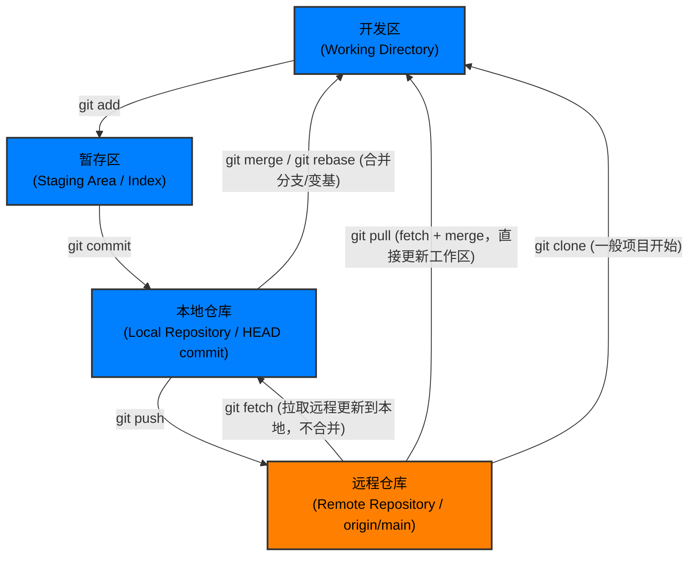

# Git & Github

## 基础概念

**Git (工具)**: 一个运行在你本地电脑上的版本控制系统。
**GitHub (平台)**: 一个基于 Git 的代码托管云平台，让你可以把本地的 Git 仓库同步到云端，方便备份和团队协作。

国内外还有很多类似的基于git的代码托管平台：GitLab、Bitbucket、Gitee (码云)、CODING (腾讯)、Codeup(阿里云 云效)、GitCode(CSDN)
* 注：Github平台已在2021年放弃使用传统的`HTTPS clone`，目前GitHub的`HTTPS clone`需要配置token等比较繁琐的步骤，一般用`SSH clone`。

### 四大工作区域
- 工作区 (Working Directory): 你当前能在电脑文件夹里看到、能用编辑器修改的代码文件。
- 暂存区 (Staging Area): 一个过渡区，你把确认修改好的文件放进去，准备稍后一起提交。
- 本地仓库 (Local Repository): 存在于你电脑里的隐藏文件夹（.git），存放着所有的历史版本记录。
- 远程仓库 (Remote Repository): 托管在 GitHub/GitLab 上的服务器，用于团队成员之间交换代码。



## 初始化
### 配置环境
1. 安装git
   - 官网链接：https://git-scm.com/
2. 环境配置
   - 在终端中打开 Git Bash
   - 配置用户名和邮箱
        ```
        git config --global user.name "你的英文昵称或姓名"
        git config --global user.email "你的常用邮箱@example.com"
        ```
        这是配置本机环境识别信息，必须执行，每次提交都会同时验证这些信息。
    - 生成 SSH 密钥 (免密登录 GitHub/Gitee 必备)
        ```
        ssh-keygen -t ed25519 -C "你的常用邮箱@example.com"
        ```
        然后重复三次 系统等待你输入时候直接按回车 (不设置额外密码)
        生成的SSH Key位置在：
        - Windows: `C:\Users\<你的用户名>\.ssh`
        - Linux: `~/.ssh/`
        ---
        - Public Key: `id_rsa.pub 或 id_ed25519.pub` (取决于使用的不同加密算法)
        - Private Key: `id_rsa 或 id_ed25519`
    - 将 Public Key 用文本编辑器/记事本打开 (Linux 可以用`cat`命令)，复制全文备用
      - 检查 从开头`ssh-`开始到末尾完整复制。
    - 配置远程环境(Github为例)
      - 点击头像，进入Settings
      - 选择 `SSH and GPG keys`
      - `New SSH key`
      - 起一个Title
      - 把刚才复制的 Public Key 贴到 Key 中
      - `Add SSH key`
* SSH 协议走本地网络 22 端口 (Port 22)，必须保证防火墙放行。

## 使用
* 注：以下操作都可使用集成开发系统(Jetbrain, VSCode, ...)中自带的git功能进行可视化管理。
### 获取项目
- 从零创建：
  - 在本地新建一个文件夹，在命令行中进入这个文件夹目录输入 `git init`，把它变成 Git 仓库。
  - 编写代码，并完成第一次提交到本地仓库
  - GitHub 网页端点击 "New" 创建一个空白仓库，复制它给你的 SSH 链接。
  - 在本地终端项目目录下输入 `git remote add origin <你的仓库链接>`，将本地仓库与云端关联。
  - 输入 `git push -u origin main` 将本地代码首次推送到 GitHub（`-u` 参数会记住这个关联，以后只需敲 `git push` 即可）。

- 从云端下载：拿到 GitHub 上的链接，输入 git clone <仓库链接>，把整个项目下载到本地工作区。
  - 仓库链接：进入仓库主页 -> 点击 ` <> Code ` -> 在 Local 下选择 SSH，直接点击右侧复制按钮即可复制链接。

### 查看项目状态
```
git status
```

### 正常工作流
- 加入暂存区
    ```
    # 添加指定文件
    git add <文件路径>

    # 或者，直接把当前目录下所有改动都放进暂存区
    git add .
    ```
- 提交到本地仓库
    ```
    # 给这次改动写一段说明，并正式记录下来：
    git commit -m "说明文字"
    ```
- 推送到云端
    ```
    # 将本地的 main 分支推送到名为 origin 的远程仓库
    git push origin main

    # -u 记住关联后如果不用修改分支可以直接
    git push
    ```
- 拉取最新代码
    ```
    # 拉取云端最新代码并自动与你的本地代码合并
    git pull origin main
    ```

### 分支管理
```
# 1. 查看当前有哪些分支
git branch

# 2. 创建并切换到一个新分支
git switch -c New-Branch-1

# 3. 在新分支上写代码...
# ... 然后常规操作：git add . && git commit -m "..."

# 4. 功能做完了，切回主干分支
git switch main

# 5. 把你的功能分支合并到 main 分支里(是将另一个分支合并到当前所在分支上)
git merge New-Branch-1
```
如果branch逻辑不熟悉或者搞不清，可以使用可视化联系平台进行练习:
https://learngitbranching.js.org/?locale=zh_CN

### 冲突管理
在merge不同分支时候，如果两个人同时修改了同一个文件的同一段代码，Git 就会不知道该听谁的。这时候无论是执行 `git pull` 还是 `git merge`，都会产生冲突（Conflict）。

终端报出信息：`CONFLICT (content): Merge conflict in...`表示这些地方存在冲突。

#### 查看并定位冲突
使用 `git status` 查看所有标红的 `both modified:` 的文件就是需要你处理的冲突文件。
用常用的代码编辑器打开存在冲突的文件，会看到 Git 留下的记号：
```
    <<<<<<< HEAD
    这是你本地刚刚写的代码。
    =======
    这是其他人在云端修改的代码。
    >>>>>>> origin/main
```

你需要人工判断保留哪一部分或者把两段代码结合起来。

修改完成后，一定要把 `<<<<<<<`, `=======`, `>>>>>>>` 这三行记号删掉并保存文件。

当你把所有冲突文件都修改完毕并保存后：
```
# 1. 告诉 Git 冲突已经修好了（放入暂存区）
git add .

# 2. 提交这次合并（可以直接敲 git commit，不用加 -m，Git 会自动弹出一个默认的合并说明）
git commit -m "解决按钮位置的合并冲突"
```
处理完冲突后续正常开发即可。

### 回溯
- 将文件从暂存区中拿出 `git restore --staged <文件名>`
- 强制放弃所有更改回到上一次提交 (谨慎使用) `git reset --hard HEAD`
